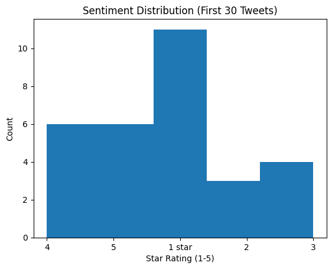

# Twitter Multilingual Sentiment Analysis

## Project Overview
A NLP system that classifies sentiment in tweets using Hugging Face's BERT model. Processes English and multilingual content.

# Key Features
| Feature | Implementation Details |
|---------|------------------------|
| Multilingual Analysis | `bert-base-multilingual-uncased` model |
| Data Visualization | Matplotlib histograms |
| Export Results | CSV generation with confidence scores |

# Sample Output
 *(Example from actual analysis)*

# Technical Stack
- Python 3.10
- Transformers 4.40.0
- Datasets 2.18.0

# How to Run
```bash
# Clone repository
git clone https://github.com/your-username/multilingual-sentiment-analyzer.git

# Open in Colab:
[](https://colab.research.google.com/github/your-username/multilingual-sentiment-analyzer/blob/main/twitter_sentiment_final.ipynb)
